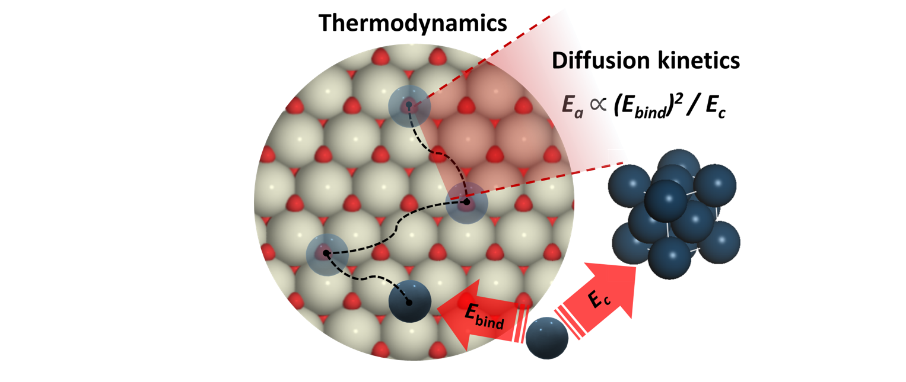
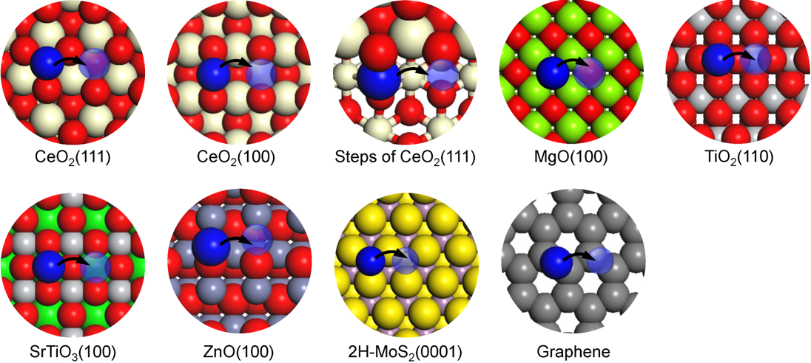

# Training Scaling Laws for Single-atom Catalysts
This repository contains the workflow of training scaling laws based on physical descriptors (features obtained from density functional theory calculations) using various machine learning methods.

The scaling laws are useful surrogate models for fast prediction of desired properties and catalyst material screening, saving computing time by doing fewer quantumn calculations.

## Developers
- Yifan Wang (wangyf@udel.edu)

## Scaling Relationships are developed for
- Ebind, the binding energy of single-metal atom on a support
- Ea, the activation barrier for metal atom diffusion

Ebind and Ea represents the __thermodynamic__ and __kinetic__ stability of single metal atom catalysts, respectively.

## Dataset
The dataset includes properties of the single-atoms on the support calculated from density functional theory (DFT) in Ea_data.csv
- 9 types of supports
- 11 types of metals: Ag, Au, Co, Cu, Fe, Ir, Ni, Pd, Pt, Rh, Ru
- 99 sample points

## Machine Learning Methods Used:
- LASSO regression
- Ridge regression
- Elastic net
- Ordinary Least Square (OLS) regression
- Genetic Programming (GP) based on sybomlic regression

## Getting Started
- gp_models: files for training genetic programming models
- ml_models: files for training statistical-learning models
    - [train_Ea: the training for Ea](ml_models/train_Ea.ipynb)
    - [train_Ebind: the training for Ebind](ml_models/train_Ebind.ipynb)

## Dependencies
- [Numpy](https://numpy.org/): Used for vector and matrix operations
- [Matplotlib](https://matplotlib.org/): Used for plotting
- [Scipy](https://www.scipy.org/): Used for linear algebra calculations
- [Pandas](https://pandas.pydata.org/): Used to import data from Excel files
- [Sklearn](https://scikit-learn.org/stable/): Used for training machine learning models
- [Seaborn](https://seaborn.pydata.org/): Used for plotting
- [Gplearn](https://gplearn.readthedocs.io/en/stable/): Used for training genetic programming models
- [Graphviz](https://www.graphviz.org/): Used for symbolic tree visualization

## Related Publication
Su, Y.; Zhang, L.; __Wang, Y.__; Liu, J.; Muravev, V.; Alexopoulos, K.; Filot, A. W.; Vlachos, D. G.; Hensen, E. J. M. Stability of Heterogeneous Single-Atom Catalysts : A Scaling Law Mapping Thermodynamics to Kinetics (2019). (Submitted)

## Special Thanks
Dr. Ya-qiong Su (DFT data)

